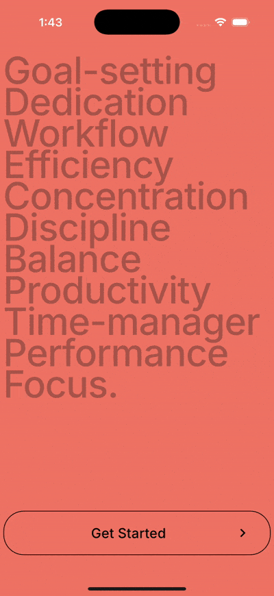
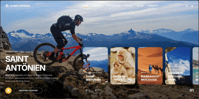

# TwinklyFlutter ✨


## 📝 Description

**TwinklyFlutter** is a Flutter-based exploration of beautiful and engaging animations. This project is part of my journey to master Flutter’s powerful animation framework and UI capabilities. Each animation is crafted to showcase different techniques and patterns in Flutter animation, ranging from beginner to intermediate levels.

---

## 📦 Features

- Flutter-native animations
- Reusable animation components
- Clean, modular code
- GIF/video previews of each animation

---

## 🎬 Animations Implemented

### 1. Character Intro Screen
A splash-style animated character reveal screen with subtle movement and fade effects.


---

### 2. Productivity App Animation
Mimics a productivity app interface with page transitions, animated task cards, and micro-interactions.



---

### 3. Globe Express (Web) – Card Morph Carousel
Web-friendly hero experience where the selected card smoothly flies into the background and morphs to full-bleed. Cards auto-advance infinitely and the list glides left while preserving layout. Text and page indicators use fade-only for elegance.

Key interactions:
- Card-to-background “fly” with rounded-to-square morph and shadow fade
- Infinite carousel with queue rotation and smooth scroll-based shift



---

## 🚀 Getting Started

Make sure to include the image in your `pubspec.yaml`:
```yaml
flutter:
  assets:
    - assets/images/logo.png
    - assets/gifs/animation-1.gif
    - assets/gifs/animation-2.gif
    - assets/gifs/animation-3.gif

```

Run the app:

```bash
flutter run -d chrome   # Web
flutter run -d ios      # iOS Simulator
flutter run -d android  # Android
```

Open the animation list:
- The app starts at the Animation Demos screen.
- Pick Character Intro, Productivity, or Globe Express (Web).

## 🌐 Web Notes
- Globe Express is optimized for web layouts and large screens, but works on mobile too.
- Hover interactions on the list screen enhance on web; they degrade gracefully on touch.
